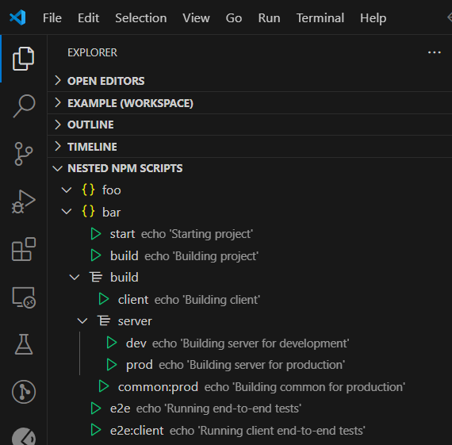

# nested-npm-scripts README

This extension is a simple tool to organize npm scripts in a nested way. It is a fork of the [NPM-scripts extension](https://github.com/Duroktar/vscode-npm-scripts).

## Features

The extension automatically detects the `package.json` file in the workspace and displays the scripts in the `Nested NPM Scripts` view. The scripts are organized in a nested way based on the script name. The script name is split by the separator (`:` by default) and the scripts are grouped by the first part of the name, recursively.

Workspaces with multiple `package.json` files are supported. The scripts are displayed in the `Nested NPM Scripts` view for each `package.json` file.

No single script groups are displayed. If a script is the only one in its group, it is displayed as a single item.

For example, the following scripts:

```json
{
  "scripts": {
    "start": "echo 'Starting project'",
    "build": "echo 'Building project'",
    "build:client": "echo 'Building client'",
    "build:server:dev": "echo 'Building server for development'",
    "build:server:prod": "echo 'Building server for production'",
    "build:common:prod": "echo 'Building common for production'",
    "e2e": "echo 'Running end-to-end tests'",
    "e2e:client": "echo 'Running client end-to-end tests'"
  }
}
```

Will be displayed as:



- start
- build
- build
  - client
  - server
    - dev
    - prod
  - common:prod
- e2e
- e2e:client

## Requirements

None?

## Extension Settings

Include if your extension adds any VS Code settings through the `contributes.configuration` extension point.

For example:

This extension contributes the following settings:

- `nested-npm-scripts.separatorCharacter`: The character used to separate the parts of the script name. Default is `:`.

## Known Issues

None?

## Release Notes

### 1.0.0

Initial release.
